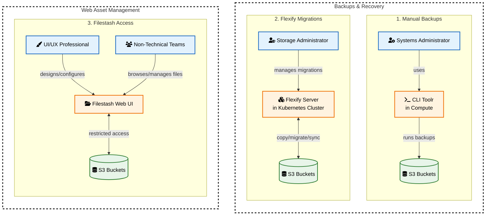

```mermaid
graph TB
    subgraph BackupsRecovery["Backups & Recovery"]
        direction TB
        
        subgraph "1. Manual Backups"
            direction TB
            SysAdmin1[fa:fa-user-cog Systems Administrator] 
            CLI1[fa:fa-terminal CLI Toolr<br/>in Compute]
            Buckets1[(fa:fa-database S3 Buckets)]
            
            SysAdmin1 -->|uses| CLI1
            CLI1 -->|runs backups| Buckets1
        end
        
        subgraph "2. Flexify Migrations"
            direction TB
            StorageAdmin2[fa:fa-user-shield Storage Administrator]
            FlexifyServer2[fa:fa-cubes Flexify Server<br/>in Kubernetes Cluster]
            Buckets2[(fa:fa-database S3 Buckets)]
            
            StorageAdmin2 -->|manages migrations| FlexifyServer2
            FlexifyServer2 <-->|copy/migrate/sync| Buckets2
        end
    end

    subgraph WebAsset["Web Asset Management"]
        direction TB
        
        subgraph "3. Filestash Access"
            direction TB
            UIUX3[fa:fa-paint-brush UI/UX Professional]
            NonTech3[fa:fa-users Non-Technical Teams]
            Filestash3[fa:fa-folder-open Filestash Web UI]
            Buckets3[(fa:fa-database S3 Buckets)]
            
            UIUX3 -->|designs/configures| Filestash3
            NonTech3 -->|browses/manages files| Filestash3
            Filestash3 <-->|restricted access| Buckets3
        end
    end

    classDef user fill:#e3f2fd,stroke:#1565c0,stroke-width:2px,color:#000;
    classDef tool fill:#fff3e0,stroke:#ef6c00,stroke-width:2px,color:#000;
    classDef storage fill:#e8f5e9,stroke:#2e7d32,stroke-width:2px,color:#000;
    classDef category fill:#ffffff,stroke:#333,stroke-dasharray: 5 5,stroke-width:3px;

    class SysAdmin1,StorageAdmin2,UIUX3,NonTech3 user
    class CLI1,FlexifyServer2,Filestash3 tool
    class Buckets1,Buckets2,Buckets3 storage
    class BackupsRecovery,WebAsset category
```