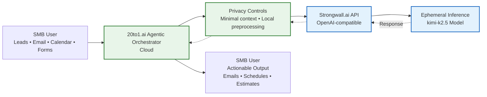

**Business Partnership Proposal**  
**Privacy-First Agentic AI Assistants for Small Businesses**  
**REQtec × Strongwall.ai**

**From:** Aaron Gilliland, CEO  
**Requisite Technologies (REQtec)**  
**https://reqtec.com** | **https://20to1.ai**  

**To:** Strongwall.ai Team  

---

### Executive Summary

REQtec is building **20to1.ai** — practical, industry-specific **agentic AI assistants** designed exclusively for small and medium businesses (SMBs). We focus on real operational workflows (lead qualification, job intake, content creation, scheduling, notifications, etc.) rather than generic chat.

Strongwall.ai’s privacy-by-design architecture, OpenAI-compatible API, and commitment to running cutting-edge open-source models on your own infrastructure represent the ideal backend for these agents.  

We propose a focused collaboration to rapidly build and deploy **2–3 fully functioning Proof-of-Concept (POC) agents** in 20to1.ai. These agents will be hosted on **Cloud** (Hetzner or equivalent) and will intelligently call Strongwall.ai’s API to deliver powerful, private, agentic assistance to SMBs — with zero reliance on Big Tech models or data practices.

This partnership aligns perfectly on values: **privacy as architecture**, independence from surveillance-driven AI, support for SMBs, and building ethical alternatives to dominant tech platforms.

---

### Why This Partnership Makes Sense

| REQtec / 20to1.ai Strengths                  | Strongwall.ai Strengths                          | Combined Value                                      |
|---------------------------------------------|--------------------------------------------------|-----------------------------------------------------|
| Deep expertise in practical SMB workflows   | Privacy-by-design (ephemeral processing, no retention, no training on user data) | Truly private agentic systems for sensitive business data |
| Tailored agentic orchestration for real tasks | OpenAI-compatible + Anthropic-compatible API (`kimi-k2.5` model) | Drop-in powerful LLM backend for multi-step agents |
| Focus on alternative tech & data sovereignty | Runs open-source models on own infrastructure   | Full stack independence from AWS/Azure/OpenAI      |
| SMB market access & implementation support  | API built for developers & stacking agents      | Real-world validation + path to production revenue |

Strongwall’s promise — **“We will never store your conversations long-term, train on private inputs, build profiles, or sell/share data”** — is exactly the foundation SMB owners need when entrusting AI with leads, customer communications, financial estimates, and operational data.

---

### Proposed POC Scope: 2–3 Functioning Agentic Assistants

We will build and deploy **production-ready POCs** (not mockups) on Cloud. Each agent will:

- Use a modern agentic framework (LangGraph / CrewAI-style orchestration or custom)  
- Make authenticated calls to Strongwall.ai’s OpenAI-compatible endpoint (`https://api.strongwall.ai/v1/chat/completions`, model `kimi-k2.5`)  
- Handle multi-step reasoning, tool use, memory, and external integrations (email, calendar, forms, notifications)  
- Maintain strong privacy boundaries (minimal data exposure, ephemeral handling where possible, leveraging Strongwall’s architecture)

**Recommended Initial POC Agents** (directly aligned with 20to1.ai roadmap):

1. **Real Estate Lead Qualification & Scheduling Assistant**  
   - Qualifies inbound leads (forms, calls, email)  
   - Schedules showings  
   - Drafts personalized follow-up emails  
   - Updates CRM/calendar

2. **Roofing Company Job Intake, Estimation & Operations Assistant**  
   - Captures job requests and gathers details  
   - Drafts estimates and proposals  
   - Sends crew updates and customer notifications  
   - Tracks job status

3. **Small Business Social Media & Content Manager** (optional third)  
   - Plans content calendar  
   - Generates platform-optimized posts and captions  
   - Summarizes performance analytics  
   - Suggests improvements

Each POC will include:
- Web-accessible interface or simple dashboard for the business owner
- Clear success metrics and demo scenarios
- Documentation for replication/scaling
- Privacy & data-handling summary

**Infrastructure**: Deployed on a Cloud — cost-effective, GDPR-aligned, data-sovereign, and philosophically aligned with both companies’ “alternative to Big Tech” positioning.

---

### Timeline & Responsibilities (Suggested)

| Phase                  | Duration     | REQtec Responsibilities                     | Strongwall.ai Responsibilities          |
|------------------------|--------------|---------------------------------------------|-----------------------------------------|
| Setup & API Access     | Week 1       | —                                           | Provide API keys + any integration guidance |
| Agent Development      | Weeks 2–5    | Build & test 2–3 agents on Hetzner          | —                                       |
| Integration & Refinement | Weeks 4–6  | End-to-end testing with sample SMB data     | Optional feedback on prompt/model usage |
| POC Delivery & Demo    | Week 6–7     | Live demos + documentation                  | —                                       |
| Review & Next Steps    | Week 7–8     | Joint review meeting                        | Joint review meeting                    |

Total estimated timeline to working POCs: **6–8 weeks**.

---

### Mutual Benefits

**For Strongwall.ai**:
- Real-world production validation of your API in multi-agent, tool-calling workflows
- Case studies and testimonials from actual SMB use cases
- Exposure to the fast-growing practical agentic AI market for small businesses
- Potential for usage-based revenue or partnership terms on 20to1.ai deployments
- Joint positioning as the privacy-first alternative stack

**For REQtec / 20to1.ai**:
- Immediate access to a high-quality, privacy-respecting LLM backend
- Faster time-to-market with production-grade agents
- Strong differentiation: “Powered by Strongwall.ai — privacy by architecture”

**For Both**:
- Credible joint marketing as leaders in ethical, private, SMB-focused agentic AI
- Foundation for deeper long-term partnership (ongoing model access, co-development, white-label opportunities, etc.)

---

### Next Steps

I would love to schedule a 30-minute call to:
1. Discuss technical integration details and API onboarding
2. Align on exact POC priorities and success criteria
3. Explore commercial terms for the POC phase and beyond
4. Review any data-processing or partnership agreement needs

Please let me know your availability or the best person on your team to connect with (Investor Relations or technical team).

I’m genuinely excited about the possibility of working together. Strongwall’s architectural approach to privacy is exactly what the market needs, and 20to1.ai gives it immediate, practical application in the SMB segment that both of us care deeply about.

Thank you for your time and consideration.

**Best regards,**  
**Aaron Gilliland**  
CEO, Requisite Technologies  
Founder, 20to1.ai  
aaron@reqtec.com  
https://reqtec.com | https://20to1.ai  

---